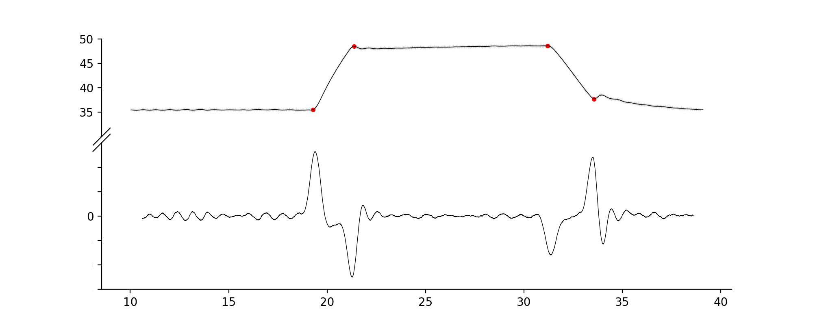

## stim_evs
> script to create timing files for fMRI analysis: input thermal stimulator recordings, outputs event timings for each 'heat' plateau

[scipy function: find_peaks](https://docs.scipy.org/doc/scipy/reference/generated/scipy.signal.find_peaks.html) 

finds local maxima/minima of the smoothed second derivative timeseries

**to run**: `$ python <path to stim_evs.py>`
